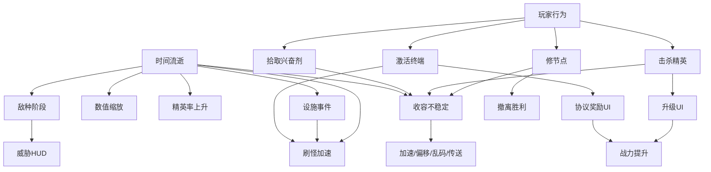
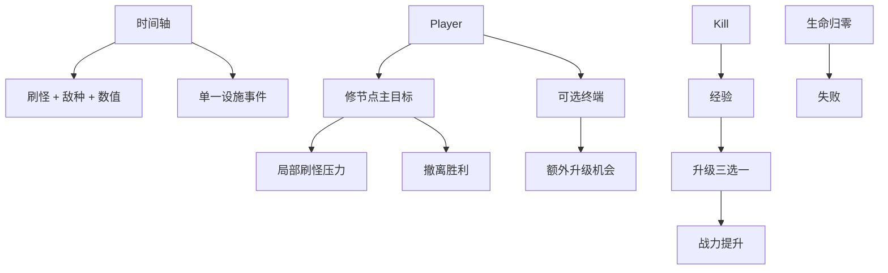

# SCP Survivor 当前版本内容与修改建议

> **历史归档**：本文可能包含已完成、已删除或已被取代的方案，仅用于追溯设计演进，不是当前批准的任务清单。当前权威来源为 [产品愿景](../product-vision.md)、[当前游戏设计](../design.md)、[开发策略](../development-strategy.md) 以及 Project Lead 的直接指令。

> **状态：已 supersede → 请参阅 [MODIFICATION_PLAN.md](./MODIFICATION_PLAN.md) 与 [GAME_DESIGN.md](./GAME_DESIGN.md)**  
> 下文为改版前的历史分析，保留作归档参考。

> 基于 `src/main.js` 实际实现整理（约 5300 行单文件原型）  
> 对比文档：`GAME_DESIGN.md`（仍描述早期 MVP，已与代码严重脱节）

---

## 1. 一句话定位

**当前版本**：一款 SCP 主题的 2D 俯视角幸存者-like 原型——选一把主武器 → 自动战斗 → 升级成长 → 在多重压力系统下修复收容节点并撤离。

**与设计文档的差异**：原设计是「生存 6 分钟 + 击败 SCP-049」；现版本已改为「修复 3 个节点 → 到达撤离电梯」，且叠加了大量尚未收敛的子系统。

---

## 2. 当前已实现功能清单

### 2.1 核心循环

| 环节 | 实现情况 |
|------|----------|
| 移动 | WASD，220 基础移速 |
| 自动攻击 | 仅使用开局选定的一把主武器（手枪 / 突破器 / 特斯拉） |
| 击杀 → 经验 | 普通敌人掉经验宝石；精英掉多颗宝石 |
| 升级三选一 | 23 种升级定义，每次随机 3 个 |
| 胜负条件 | **胜**：激活 3 个收容节点后进入撤离电梯；**败**：生命值归零 |
| 单局时长 | **无硬性时间上限**（与设计文档 6 分钟不同） |

### 2.2 武器系统（3 选 1）

开局在选武器界面三选一，整局只主动使用这一把（另有「解锁其他武器」升级，但逻辑上容易与开局选择冲突）。

| 武器 | 定位 | 特有机制 |
|------|------|----------|
| 基金会勤务手枪 | 中远程单体 | 多弹丸、穿透、伤害/攻速成长 |
| 基金会收容突破器 | 近距爆发控场 | 弹匣 4 发、装填 2s、击退、护甲破碎、防暴盾、冲击波等 **6 项专属升级** |
| 特斯拉发射器 | 链式 AOE | 链击数量、射程、冷却等 **4 项专属升级** |

### 2.3 敌人（6 种行为单位）

**普通敌人（3 种）**

| 类型 | 行为 | 出现节奏 |
|------|------|----------|
| 感染职员 | 近战追击 | 0–45s 独占，之后权重逐渐下降 |
| 异常爬行者 | 快速近战 | 45s 后混入，电力故障事件额外加权 |
| 安保无人机 | 远程保持距离射击 | 90s 后混入，红色警报事件额外加权 |

**精英敌人（3 种 + 1 子单位）**，75s 后开始出现：

| 类型 | 特殊能力 |
|------|----------|
| 防暴镇压单位 | 正面减伤、冲锋预警 |
| 闪现潜行者 | 传送 + 冲刺 |
| 复制生物体 | 死亡分裂为 3 个生物体碎片 |

精英击杀：+5 收容不稳定、大量经验、20% 概率掉落战斗兴奋剂。

### 2.4 成长与奖励（两套并行）

#### A. 升级系统（Level Up，23 项）

- **通用 / 手枪向（8）**：伤害、攻速、移速、生命、额外弹丸、穿透、拾取范围、紧急治疗
- **武器解锁（2）**：解锁突破器、解锁特斯拉（与开局三选一存在设计重叠）
- **突破器专属（6）**：液压枪托、压制弹、快速装填、穿甲弹、防暴盾协议、收容冲击波
- **特斯拉专属（4）**：增压电压、额外链击、快速放电、扩展电场

#### B. 协议奖励（Protocol Reward，6 项）

通过 **稳定化终端** 激活获得，与升级界面独立：

紧急弹药、快速响应协议、加固背心、医疗补给箱、研究数据缓存、机动授权

> 注意：协议奖励中的加伤、减 CD、加生命、加移速、治疗、经验，与升级池大量重复。

### 2.5 局内目标系统（两套并行）

#### A. 收容节点修复（主胜利线）

- 地图上固定 3 个节点（A / B / C）
- 站在节点范围内持续修复 10–15 秒
- 全部激活后右下角出现 **撤离电梯**，进入即胜利
- 每完成一个节点：+10 收容不稳定

#### B. 稳定化终端（可选奖励线）

- 70s 后周期性在地图生成，存在约 35s
- 站在终端旁激活 5 秒（离开会衰减进度）
- 激活期间刷怪速率 ×1.25，敌人会被拉向终端
- 成功：弹出协议奖励三选一；失败：终端消失
- 激活时增加额外刷怪压力

### 2.6 难度与压力系统（**重叠最严重区域**）

当前同时存在 **至少 6 层** 独立的「越玩越难」机制：

| 系统 | 触发方式 | 主要效果 |
|------|----------|----------|
| **① 刷怪间隔曲线** | 随时间 0→240s 线性加速 | 间隔 900ms → 250ms |
| **② 敌种阶段** | 0 / 45 / 90 / 180s 分四段 | 混入爬行者、无人机，额外刷怪概率上升 |
| **③ 敌人数值缩放** | 随时间至 360s / 420s | 生命 +35%、伤害 +22% |
| **④ 威胁等级 HUD** | 与 ② 同步 | 低 / 上升 / 高 / 危急（纯展示，与阶段一一对应） |
| **⑤ 精英出现率** | 75s 后分早/中/晚三档 | 精英概率 8%→18%，双精英概率上升 |
| **⑥ 收容不稳定** | 被动每 10s +1；击杀精英 +5；拾取兴奋剂 +15；修节点 +10 | 4 档阶段：敌人加速、屏幕抖动、诱饵、子弹偏移、HUD 乱码、敌人短距传送 |
| **⑦ 设施事件** | 60s 后每 55–80s 随机 | 电力故障（视野变暗 + 爬行者加权）/ 红色警报（刷怪 ×1.35 + 多效果） |
| **⑧ 终端激活压力** | 玩家主动交互时 | 刷怪 ×1.25 + 敌人被吸引 |

这些系统 **都在做「增加压力」**，但彼此缺少清晰分工，玩家难以归因「为什么突然变难了」。

### 2.7 辅助与 UI

- **战斗兴奋剂**：精英掉落，+15 生命、+20% 移速 6s，但 **+15 收容不稳定**（收益与代价倒挂感强）
- **构筑面板**：TAB 查看当前数值与升级等级
- **HUD 元素**：生命/时间/击杀、等级、经验条、威胁、精英计数、收容不稳定条、武器状态、主目标、节点状态、设施事件/终端状态、事件横幅、音频状态
- **调试模式**（`DEBUG_MODE = true`）：大量快捷键（加经验、跳时间、刷精英、完成终端等）——正式版应关闭

### 2.8 设计文档中有、代码中 **未实现**

- SCP-049 Boss 战
- SCP-500 异常物品
- 6 分钟固定时间轴与 Boss 出场
- 元进度 / 多角色 / 多地图

---

## 3. 主要问题诊断

### 3.1 系统堆叠，认知负担过高

单局内玩家需要同时理解：

- 升级三选一（23 池）
- 协议奖励三选一（6 池）
- 3 个收容节点进度
- 随机终端的出现与风险
- 收容不稳定条及其 4 档惩罚
- 两种设施事件
- 3 种精英的特殊行为

对原型阶段来说，**可玩内容偏多，可学成本偏高**。

### 3.2 难度机制重合（核心问题）

以下机制效果高度相似，建议合并或删减：

```
时间流逝 ──┬── 刷怪加速（①）
           ├── 新敌种混入（②）
           ├── 敌人变强（③）
           ├── 威胁标签（④）← 与②信息重复
           ├── 精英增多（⑤）
           └── 设施事件加压（⑦）

玩家行为 ──┬── 修节点 → +不稳定（⑥）→ 与「完成目标」惩罚矛盾
           ├── 打精英 → +不稳定（⑥）→ 与「鼓励战斗」矛盾
           └── 吃兴奋剂 → +不稳定（⑥）→ 与「拾取奖励」矛盾

可选目标 ──┬── 终端激活 → 协议奖励 + 刷怪压力（⑧）
           └── 与主目标（修节点）争夺站位与时间
```

**「收容不稳定」** 与 **「威胁等级 / 时间阶段 / 设施事件」** 都在表达「局势恶化」，是最优先需要二选一或合并的系统。

### 3.3 胜利路径与设计意图漂移

| 维度 | GAME_DESIGN.md | 当前代码 |
|------|----------------|----------|
| 核心张力 | 撑到 6 分钟 + 打 Boss | 无时间压力，修节点撤离 |
| 玩家动机 | 生存 + 变强 | 生存 + 变强 + 跑图修点 + 可选终端 |
| SCP 叙事 | SCP-049 终局 | 仅主题包装，无 Boss |

节点修复是合理的玩法，但与原「幸存者撑时间」范式不同，且 **修节点反而推高不稳定**，削弱「我在推进进度」的正反馈。

### 3.4 武器与升级池冗余

- 开局已三选一，但升级池仍含「解锁另一把武器」——选手枪的玩家可能刷到解锁特斯拉，却整局仍用手枪战斗，体验割裂。
- 突破器 6 项专属升级 + 复杂状态（护甲破碎、装填、冲击波），占开发量最大，但仅 1/3 玩家选用。
- 协议奖励与升级池在数值维度上重复（加伤、减 CD、治疗、移速）。

### 3.5 HUD 与信息过载

屏幕同时展示 10+ 条状态信息，部分重复（威胁等级 vs 不稳定阶段 vs 设施事件均表示「形势严峻」）。新手难以判断 **当前最该关注什么**。

---

## 4. 修改建议（按优先级）

### P0 — 先定「这一版到底是什么游戏」

在改代码前，先明确单局目标，三选一：

| 方案 | 描述 | 适合 |
|------|------|------|
| **A. 经典幸存者** | 撑过 N 分钟 → Boss 战（回归设计文档） | 想突出 SCP-049、战斗爽感 |
| **B. 任务撤离** | 修节点 / 完成 N 个目标 → 撤离（保留现方向） | 想突出地图目标与风险决策 |
| **C. 混合** | 前 4 分钟幸存者成长 + 后 2 分钟强制修点 / Boss | 兼顾两者，但需严格控制系统数量 |

**建议**：当前代码已偏向 **方案 B**，但残留大量 **方案 A** 的无终点生存逻辑（无限刷怪、无 Boss）。应删掉与选定方案无关的系统，而不是继续叠加。

---

### P1 — 合并难度系统（建议只保留 2 层）

**推荐结构：**

```
第 1 层【时间轴】（主难度曲线，不可回避）
  - 刷怪间隔 + 敌种混合 + 敌人数值成长
  - 用一条清晰的「阶段时间轴」呈现（如 0:45 / 1:30 / 3:00）

第 2 层【局势事件】（可感知、可准备的变数）
  - 保留 1–2 种设施事件（电力故障 / 红色警报二选一或轮换）
  - 删除或大幅简化「收容不稳定」
```

**关于收容不稳定的三种处理：**

1. **删除**（最激进）：压力完全交给时间轴 + 设施事件。
2. **改为主目标计量**（推荐）：不稳定仅随 **修节点进度** 上升，修完节点清零或锁定；不再被动增长、不因杀精英/捡补给上升。叙事上变为「修复过程扰动收容」。
3. **保留但降级**：只保留 2 档（稳定 / 失控），效果仅保留一项（如敌人小幅加速），去掉诱饵、传送、HUD 乱码、子弹偏移。

**威胁等级 HUD**：与敌种阶段完全重复，建议 **删除独立威胁文字**，或改为显示「当前阶段名称」（如「第一阶段：职员感染」）。

---

### P2 — 合并奖励系统

**建议：只保留「升级三选一」一种成长 UI。**

| 当前 | 建议 |
|------|------|
| 稳定化终端 → 协议奖励界面 | 终端激活成功 → **直接给一次额外升级三选一**（或大量经验） |
| 6 项协议奖励定义 | 删除 `PROTOCOL_REWARD_DEFINITIONS`，相关内容并入升级池或删除重复项 |
| 升级池 23 项 | 精简至 **10–12 项**（见下） |

**精简后的升级池示例（12 项）：**

1. 伤害提升  
2. 攻击速度  
3. 移动速度  
4. 最大生命  
5. 弹丸 +1 / 穿透 +1（手枪合并或二选一）  
6. 拾取范围  
7. 紧急治疗  
8. 突破器专属 ×2（如：击退强化 + 装填/弹匣）— 仅选突破器时出现  
9. 特斯拉专属 ×2（链击 + 冷却）— 仅选特斯拉时出现  

**删除「解锁其他武器」升级**——武器已在开局选定。

---

### P3 — 收敛局内目标

**推荐：单线主目标 + 单线可选奖励**

```
主目标（必做）：修复 3 个收容节点 → 撤离
可选奖励（可做可不做）：稳定化终端 → 额外升级机会
```

调整：

- 修节点 **不应** 无条件增加收容不稳定；改为修节点时局部刷怪压力上升（类似终端机制），修完即解除。
- 终端与节点 **不要在同一时段强制重叠**；可错开生成时间，避免「两边都要站圈」的撕裂感。
- 若保留不稳定系统，修节点应是其 **唯一主要来源**，让玩家理解「修点 = 冒风险推进进度」。

---

### P4 — 武器系统瘦身

1. **保留三选一开局**，但每把武器的专属升级 **最多 3 项**，突破器机制保留核心一条（如：弹匣 + 击退），砍掉护甲破碎、防暴盾、冲击波等可后续再加。
2. 整局只使用选定武器，删除 `unlockShotgun` / `unlockTesla` 升级。
3. `syncCombatStatsFromWeapons` 目前只同步手枪——若长期只做单武器，可简化武器状态机。

---

### P5 — HUD 与 DEBUG 清理

**HUD 建议只保留 5 块：**

1. 生命 + 时间/击杀  
2. 等级 + 经验条  
3. 当前武器状态（1 块）  
4. 主目标进度（节点 x/3）  
5. 当前事件提示（1 条横幅，不常驻多行设施状态）

右侧多行「事件 / 终端 / 稳定化次数」可合并为 **单一事件条**，无事件时不显示。

**发布前**：`DEBUG_MODE = false`，或拆到独立 debug 构建。

---

### P6 — 同步更新 GAME_DESIGN.md

当前设计文档已误导后续开发。在确定 P0 方案后，应重写文档中的：

- 胜负条件  
- 时间轴  
- 系统列表（明确「不做什么」）  
- MVP 边界  

---

## 5. 建议的下一版范围（「瘦身 MVP」）

若下一迭代目标是 **可玩、可理解、可扩展**，建议范围：

| 保留 | 暂缓 / 删除 |
|------|-------------|
| 1 张地图、WASD、自动攻击 | 协议奖励独立界面 |
| 3 选 1 武器（各 3 个专属升级） | 收容不稳定 4 档全套效果 |
| 3 普通敌人 + 1 种精英（先只做防暴单位） | 另 2 种精英 + 分裂子单位 |
| 10 个通用升级 | 23 个升级 + 6 个协议奖励 |
| 时间轴难度（刷怪 + 敌种阶段） | 威胁等级 HUD（重复信息） |
| 1 种设施事件（电力故障 OR 红色警报） | 两种事件 + 终端刷怪叠加 |
| 3 节点修复 → 撤离胜利 | 无终点无限生存 |
| 关闭 DEBUG_MODE | 调试快捷键 |

**预估**：可削减约 30–40% 的 `main.js` 逻辑复杂度，同时让玩家在一局内能讲清「我要干什么、为什么会变难」。

---

## 6. 系统关系简图（当前 vs 建议）

### 当前（过于复杂）



### 建议（收敛后）



---

## 7. 总结

| 维度 | 现状 | 建议方向 |
|------|------|----------|
| 内容量 | 远超 MVP，单文件 5300 行 | 砍到「能讲清一局玩法」的体量 |
| 难度 | 6–8 套压力系统叠加 | 合并为「时间轴 + 1 种事件」 |
| 成长 | 升级 + 协议奖励双池重复 | 合并为单一升级 UI |
| 目标 | 修节点 + 终端 + 无限生存混杂 | 单线主目标 + 可选奖励 |
| 叙事 | 无 Boss，与原设计脱节 | 选定路线后补 Boss 或重写文档 |
| 武器 | 三选一 + 解锁升级矛盾 | 删除解锁升级，缩减专属树 |

**最先动的三刀（投入产出比最高）：**

1. 删除或重构 **收容不稳定** 与其他难度系统的重叠部分  
2. 合并 **协议奖励 → 升级**，升级池砍到 12 项以内  
3. 明确 **胜利条件** 并删除无终点生存逻辑，同步更新 `GAME_DESIGN.md`

---

*文档生成日期：2026-07-03*
