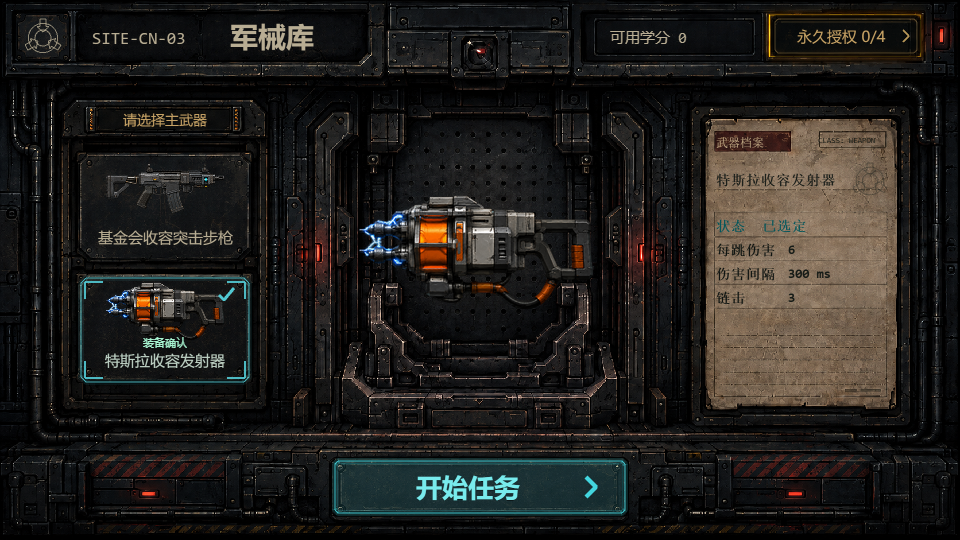
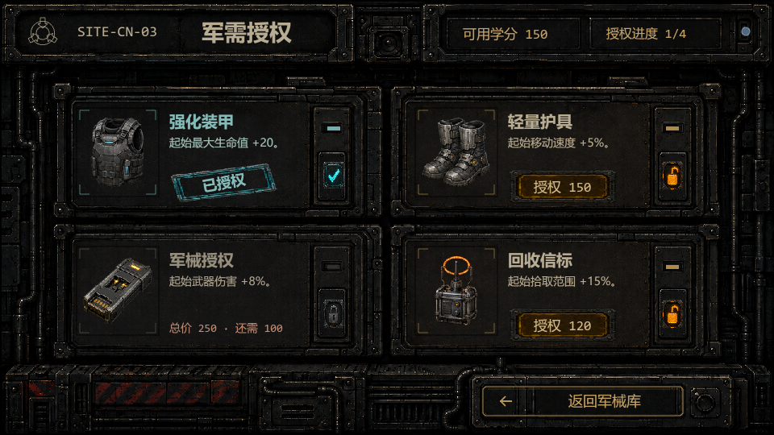
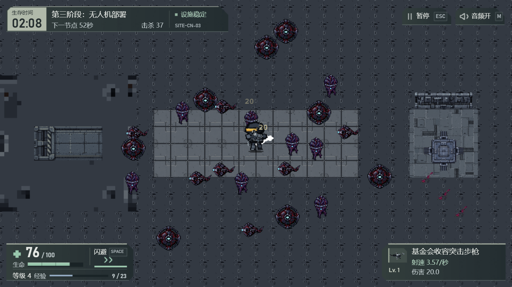

# U0、U1 与 U2 表现收口

日期：2026-09-09。项目所有者确认保留当前 U1，并认可 U2 左右分置仪表及 HiDPI 清晰度修复。本次仅整理这些已认可实现、必要文档和验收证据；U3 未启动。

## 当前状态与范围

收口分支为 `codex/ui-u0-u2-closeout`，从 `a790aad952dd1da2c4a6020a89c242ee687c6955` 提取本次批准内容，形成以下两个独立提交；具体远端集成状态以对应 PR 与 Git 记录为准：

| 提交 | 内容 |
|---|---|
| `92df1c6d07ef8bb0c15111a1bb0ada7a79e7f3fb` | U0 站点与语义规范、U1 军械库和永久商店、正式素材、相关测试 |
| `7b53fdb7b4dceb25947188cfd7116601779cd66a` | U2 左右分置 HUD、设施通知、HiDPI 文字与相关测试 |

U1 实现来自 `codex/ui-art-u0-u1-implementation` 的已认可工作区内容；原实现与设计工作区继续保留。没有将旧 `main` 的被替代方案、旧角色方案或整包历史归档导入收口分支。两张不再加载的旧 U1 底盘 `armory-chassis.png`、`quartermaster-chassis.png` 留在原 WIP，未随本次提交加入；其来源记录保留在[素材登记表](./asset-register.md)。

本次不改变玩法、数值、武器 allowlist、六分钟时间线、胜负、购买语义或 `localStorage` 格式；不改造 U3 的升级、构筑、暂停或结算页面。`PreloadScene`、fallback factory、`UIManager`、`AudioManager` 和 Scene 公共生命周期继续沿用既有合同。U1 的正式素材通过获准的 manifest 项接入，U2 不新增位图或字体文件。远端合并、版本发布和部署状态以[当前项目状态](../project-status.md)及实际 Git 结果为准。

## 已保留的 U0 与 U1

- U0 使用统一 `SITE-CN-03` 站点身份与现有 Theme 语义 token；保留旧接口和回退路径。
- 军械库为左侧双武器选择轨、中央武器展示、右侧纸面档案和底部部署操作。只显示现有 `pistol` / `tesla`，内部兼容 `shotgun` 不出现在选择页。
- 永久商店为 2×2 物资卡。可购买、已授权和学分不足分别以购买按钮、印章和差额呈现；四项 `META_PERKS` 仍为一次购买、永久生效。
- 两页继续读取只读状态投影，并调用原有购买、返回和部署命令。未选择不能部署，商店往返保留武器选择，重复点击已授权物资不再次扣款。
- 保留 09-05 五点精修：纸面阅读层、购买按键反馈、武器缩略图尺寸、次级授权入口亮度和印章位置。正式图缺失时采用页内既有图标或程序控件回退。

## U2 最终布局与状态合同

逻辑视口保持 `960×540`。布局来自项目所有者批准的 `u2-split-instruments-2026-09-09` 蓝图及其最后一次闪避图标修正。

| 区域 | 位置与尺寸 | 当前内容 |
|---|---|---|
| 左上任务与设施 | 左上，416×48 | 时间、阶段、下一节点、击杀、设施与站点；事件详情向下展开 24px |
| 独立 Boss | `(446, 12)`，274×46 | 既有 Boss 名称与真实血量，不新增阶段规则 |
| 左下仪表 | `(12, 458)`，238×70 | 生命、危急、等级、经验和闪避 |
| 右下仪表 | `(716, 458)`，232×70 | 武器身份、等级、攻击状态、伤害或每跳伤害与链击 |
| 右上系统入口 | 各 96×40 点击范围 | 暂停/继续、静音/恢复 |

两块底部仪表之间留空 466px。灰绿石墨底、薄边和分级字号提供承托；右下是新增的局部占用，不声称整屏遮挡面积进一步减少。

闪避可用时显示亮双箭头与满格进度条，不显示“就绪”；冷却时为暗箭头、真实剩余秒数和回填比例。SPACE 提示仍只说明既有输入，HUD 不提供点击施放。Tesla 直接显示现有“等待锁定”或“持续电击中”等状态及数值，不把二值 `statusRatio` 画成蓄力或冷却。低生命强调医疗图标、危急文字、血条和细顶边，生命数字保持稳定可读。

仍沿用 `getHudPresentation()` 等现有状态投影和接口语义。mission、facility、vitals、weapon、system 的公共引用和兼容入口保留；屏幕上的分组不改变领域归属。设施通知按原有时钟、Boss 优先级和淡出规则更新，拾取范围与半径变化提示保留原输入和时限。

## HiDPI 文字与回退

仅正常战斗 HUD 的文字通过私有 `hudTextOverlay.js` 使用原生 SVG text 按浏览器像素绘制。现有 Phaser Text 继续提供文字、样式、测量、状态与回退；原生层跟随父层显隐、透明度、变换和相机。面板、状态条、图标、世界画布、逻辑尺寸和点击热区不变，数字采用 600 字重。

暂停、升级、构筑和结算覆盖页出现时回到原 canvas 字体路径，避免文字浮到遮罩前。文字层失败或移除时恢复 Phaser 渲染，shutdown、destroy、restart 清理旧层。这是现有 HUD 的清晰度修复，不是 U3 页面改版。

## 验证与证据边界

本轮收口重新验证了两个提交的完整测试和生产构建，生成字节与对应验收构建一致：

| 切片 | 完整测试 | 构建入口 | SHA-256 |
|---|---:|---|---|
| U0/U1 | 695/695 | `index-Bw2CQCmN.js` | `EE8791A2B3413B00BC7DC3A8E192EBF36040C142F8F36D03889B98C69DED62A3` |
| U2 + HiDPI | 722/722 | `index-BG1-lA3W.js` | `6489FCC54324CB04B1D5151F8AADBBD7D91C980A65B6EB8224EB90C22DB834EF` |

原有独立审查与实机记录覆盖以下内容：

- U1 原生 `960×540` 军械库、四项商店与三种购买状态、鼠标按下/移出/松开、购买一次、商店往返和部署；见 [09-05 精修记录](./2026-09-05-u1-polish-review.md)。
- U2 常态、低生命、停电、Boss、Tesla 等待/持续、敌弹密集、闪避冷却/恢复、通知消退，以及暂停/恢复、静音、SPACE 和拾取提示。
- HiDPI 实测 `960×540` CSS 视口、DPR 1/1.5/2，对应 `960×540`、`1440×810`、`1920×1080` 页面截图；检查文字边界、通知父层 alpha 同步、覆盖页 canvas 回退、真实 restart 后单一新层与 DOM 故障回退。
- HiDPI 轮的构筑页通过已有处理函数检查；不将其写成该轮实际按住 TAB 的人工验收。旧 split 实装轮另有实际 TAB 输入记录。

仓库内保留少量可复核图片：[低生命](./evidence/u0-u2/u2-low-health.png)、[Boss](./evidence/u0-u2/u2-boss.png)、[密集 Tesla](./evidence/u0-u2/u2-dense-tesla.png)。[证据清单](./evidence/u0-u2/manifest.json)记录来源、尺寸与哈希。这些都是实际游戏渲染；危险和压力状态使用隔离页面中的真实引擎及临时测试数据构造，不能当作完整六分钟自然通关证据。HiDPI 页面图含原生文字层，不能用 canvas 单独导出代替。

本轮另在最终构建上完成回归 smoke，详情见证据清单的 `currentSmoke`：

- 正常测试源 `4225`：标题进入军械库，未选不能部署；选择 `pistol` 后进入商店，学分不足不能购买；临时 150 学分购买装甲后归零且授权，重复点击不重复扣款；返回保留选择，开战显示 120/120 起始生命。
- 实际 `ESC` 暂停/恢复和 `M` 静音通过；构筑、升级和结算通过已有处理函数触发，实际点击升级卡片与结算重启按钮。重启移除旧 SVG，下一局只有一个新文字层。
- 故障测试源 `4226` 将全部 U1 新素材响应改为 404，回退军械库、商店仍可操作并开始战斗；临时移除 SVG 后，29 个 Phaser Text 的渲染方法全部恢复。
- 两个测试 origin 初始无存档，购买与结算仅写入测试 origin；完成后恢复空白并 reload，未访问或修改用户原试玩存档。正常与故障源均无应用 error，仅有既有 `player-response-operative-sheet` 缺失后的角色 fallback 警告。

本轮回归不重新开启已认可的视觉方向；仍不声称完成完整六分钟自然通关。具体远端集成状态以对应 PR 与 Git 记录为准，代码收口不构成新版本发布或部署。

## 被替代方案与后续边界

| 历史内容 | 当前处理 |
|---|---|
| 09-01 U1 四行商店、双大卡 | 由 09-04 视觉重置和 09-05 原蓝图返工/精修替代；领域、购买和回退合同继续保留 |
| 09-04 hero 仅中央使用、selector 只用共享图标 | 09-05 正式 hero 扩为左栏缩略图与中央展示，共享图标保留作回退 |
| U2 A 初稿及初次实装，reduced/compact/integrated 迭代 | 由最终 split-instruments 布局替代，不作为待执行方案入库 |
| U2 单独下中闪避、可见“就绪” | 改入左下仪表，采用亮/暗双箭头及真实冷却 |
| split 首版单倍文字及旧验收页 | 由 HiDPI 修复与对应页面截图补充替代；旧原始证据留在外部归档 |
| 旧路线“下一项 U0 + U1 设计” | 已过期；本次仅收口 U0/U1/U2，不自动进入 U3 或标题、弹体、设施氛围的后续阶段 |

09-05 两份 U1 报告保留当日的未提交、未验收等时间状态；当前认可、提交与证据入口以本文为准。历史蓝图、全量 before 副本、临时服务器、dist 和工作区快照不随本次文档整包入库。

GPT 等级：Level 0，已认可实现的有限收口与验证；未引入产品、架构或发布路线的新决定。
