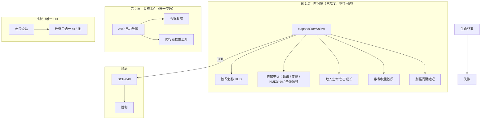

# SCP Survivor 最终版修改计划

> 基于 [VERSION_REVIEW.md](./VERSION_REVIEW.md) 讨论结论整理  
> 决策确认日期：2026-07-03

---

## 1. 决策摘要

| 编号 | 你的决定 | 最终方向 |
|------|----------|----------|
| **P0** | 方案 A | 经典幸存者：**撑满时间轴 → SCP-049 Boss 战** |
| **P1** | 双层结构；第一层含原「不稳定」视觉/机制效果 | **时间轴**（刷怪 + 敌种 + 数值 + 诱饵/传送/HUD乱码/子弹偏移）；**仅保留电力故障**事件 |
| **P2** | 按建议 | **单一升级三选一**；删除协议奖励；升级池 **12 项** |
| **P3** | 直接去掉 | **删除**收容节点、撤离电梯、稳定化终端（整模块移除） |
| **P4** | 按建议 | 开局三选一武器；每把 **最多 3 项专属升级**；删除解锁武器升级；精简突破器机制 |
| **P5** | 按建议（节点已删，HUD 第 4 块改为阶段/倒计时） | **5 块 HUD** + `DEBUG_MODE = false` |
| **P6** | 按建议 | **重写** `GAME_DESIGN.md` 与代码对齐 |

---

## 2. 目标版本定义（改完后的游戏）

### 2.1 一句话

基金会安保官被困收容设施，在 **6 分钟时间轴** 内杀怪升级、应对 **电力故障**，撑到终点与 **SCP-049** 决战并取胜。

### 2.2 单局流程

```
选武器（三选一）
  → 0:00–6:00 生存阶段（自动攻击、拾取经验、升级三选一）
  → 时间轴逐步加压（敌种 / 数值 / 感知干扰）
  → 3:00 电力故障（唯一设施事件）
  → 4:00 SCP-500 刷新（一次性拾取）
  → 6:00 清场或停刷，SCP-049 登场
  → 击败 Boss → 胜利；生命归零 → 失败
```

### 2.3 胜负条件

| 结果 | 条件 |
|------|------|
| **胜利** | 在生存阶段存活至 6:00，并在 Boss 战中击败 SCP-049 |
| **失败** | 生命值归零（生存阶段或 Boss 阶段均可） |

### 2.4 明确不做（本版范围外）

- 收容节点修复 / 撤离电梯
- 稳定化终端 / 协议奖励界面
- 红色警报事件
- 「解锁另一把武器」类升级
- 独立「收容不稳定」数值条（效果并入时间轴，不再单独计量）
- 元进度、多地图、多角色

---

## 3. 系统架构（最终态）



---

## 4. 时间轴设计（6 分钟，对齐方案 A）

> 原 `getDifficultyDirectorState()` 的四段敌种逻辑 **保留并命名**；原 `containmentInstability` 的阶段性效果 **迁移到下列时间点**，不再使用独立数值条。

| 时间 | 阶段名称（HUD 显示） | 刷怪 / 敌种 | 数值成长 | 感知干扰（来自原不稳定系统） | 其他 |
|------|----------------------|-------------|----------|------------------------------|------|
| **0:00** | 第一阶段：职员感染 | 仅感染职员；间隔 900ms 起 | 基准 | 无 | 开局 |
| **1:00** | 第二阶段：爬行者渗入 | 爬行者混入（权重上升） | 缓慢成长 | 无 | — |
| **2:00** | 第三阶段：无人机部署 | 安保无人机加入 | 继续成长 | **诱饵**开始出现（低频） | — |
| **3:00** | 第四阶段：电力故障 | 爬行者权重额外上升 | 继续成长 | 诱饵维持 | **电力故障事件**触发（视野变暗，持续至 3:25 或固定 25s） |
| **4:00** | 第五阶段：异常介入 | 刷怪间隔进一步缩短 | 中高 | **敌人短距传送**启用 | **SCP-500** 在地图随机一点生成（一次性） |
| **5:00** | 第六阶段：收容加压 | 额外刷怪概率显著提高 | 接近上限 | **HUD 乱码/抖动** + **子弹偏移** | 屏幕提示「Boss 即将到来」 |
| **6:00** | 终局：SCP-049 | **停止常规刷怪**；进入 Boss 战 | Boss 战独立数值 | 感知干扰 **关闭**（Boss 战需清晰可读） | SCP-049 登场 |

### 4.1 感知干扰效果参数（从 `BALANCE.containmentInstability` 迁移）

| 效果 | 触发时间 | 实现来源（现有代码可复用） |
|------|----------|----------------------------|
| 诱饵 | ≥ 2:00 | `spawnInstabilityDecoy` / `updateInstabilityDecoys` |
| 敌人传送 | ≥ 4:00 | 精英/敌人上的 `enemyTeleport` 定时逻辑 |
| HUD 乱码 | ≥ 5:00 | `updateInstabilityHudCorruption` |
| 子弹偏移 | ≥ 5:00 | `attackWithPistol` 等中的 `bulletDeviationDeg` |
| 屏幕抖动 | ≥ 5:00（可选） | 原 `cameras.main.shake`，Boss 战关闭 |

**删除：** `containmentInstability` 数值、`passiveTick`、击杀/拾取/修节点导致的不稳定增减、顶部不稳定进度条。

### 4.2 电力故障（唯一 Layer 2 事件）

| 项 | 值 |
|----|-----|
| 触发 | **固定 3:00**（不再随机间隔轮询） |
| 持续 | 25s（沿用 `powerOutage.durationMs`） |
| 效果 | 视野黑暗 + 爬行者权重 +0.2 |
| 删除 | `redAlert` 事件定义、`scheduleFacilityEventWarning` 随机池、`triggerEventPulse` 红色脉冲 |

---

## 5. 成长系统（P2 最终升级池 · 12 项）

仅保留 **Level Up 三选一**；删除 `PROTOCOL_REWARD_DEFINITIONS` 及 `showProtocolRewardOverlay` 全流程。

### 5.1 通用升级（7 项，所有武器可用）

| key | 名称 | 说明 | 武器过滤 |
|-----|------|------|----------|
| `damage` | 伤害提升 | 当前武器伤害 +20% | 按 `selectedWeaponId` |
| `attackSpeed` | 攻击速度 | 当前武器冷却 -15% | 按 `selectedWeaponId` |
| `moveSpeed` | 移动速度 | 移速 +10% | 无 |
| `maxHealth` | 最大生命 | 上限 +20，并恢复 20 | 无 |
| `projectileCount` | 额外弹丸 | 手枪：+1 弹丸（上限 5） | 仅手枪 |
| `penetration` | 弹丸穿透 | 手枪：穿透 +1 | 仅手枪 |
| `pickupRadius` | 拾取范围 | 经验拾取范围 +25% | 无 |
| `emergencyHeal` | 紧急治疗 | 立即恢复 25 HP | 无 |

> 注：通用 7 项 + 武器专属 5 项 = 12；手枪专属已含在 `projectileCount` / `penetration` 中。

### 5.2 突破器专属（3 项，仅 `selectedWeaponId === "shotgun"`）

| key | 名称 | 保留机制 | 删除机制 |
|-----|------|----------|----------|
| `breacherKnockback` | 击退强化 | 击退倍率提升 | — |
| `breacherSuppression` | 压制弹 | 减速 + 硬直延长 | — |
| `breacherMagazine` | 扩容弹匣 | 弹匣 +1、装填略缩短 | 快速装填概率、护甲破碎、防暴盾、冲击波 |

### 5.3 特斯拉专属（2 项，仅 `selectedWeaponId === "tesla"`）

| key | 名称 | 说明 |
|-----|------|------|
| `teslaChains` | 额外链击 | 链击目标 +1（上限 8） |
| `teslaCooldown` | 快速放电 | 冷却 -12% |

### 5.4 从升级池删除的项

`unlockShotgun`、`unlockTesla`、`breacherHydraulic`（合并为 breacherKnockback）、`breacherRapidReload`、`breacherArmorPiercing`、`breacherRiotShield`、`breacherShockwave`、`teslaDamage`、`teslaRange`，以及全部 6 项协议奖励。

### 5.5 升级可用性规则

- `getLevelUpChoices()` 只从 **当前武器可用** 的条目中抽取 3 个。
- 选手枪时池 = 7 通用（含弹丸/穿透）= 7 项；选突破器 = 7 通用 + 3 专属 = 10 项；选特斯拉 = 7 通用 + 2 专属 = 9 项。

---

## 6. 武器系统（P4 最终态）

| 项 | 决定 |
|----|------|
| 开局 | 保留三选一界面 |
| 局内 | **仅使用**所选武器，`initWeapons` 只解锁选中项 |
| 突破器保留 | 弹匣、装填、击退、压制、散布射击 |
| 突破器删除 | 护甲破碎 UI/逻辑、防暴盾、最终弹冲击波、碰撞连锁伤害 |
| 代码 | 简化 `applyBreacherPelletEffects`、`syncCombatStatsFromWeapons` 绑定当前武器 |

---

## 7. 敌人与精英（瘦身建议，与方案 A 一致）

| 类型 | 决定 |
|------|------|
| 普通敌人 | **保留 3 种**（感染职员 / 爬行者 / 无人机） |
| 精英 | **暂保留 3 种**（实现已存在）；若工期紧，可降为 **仅防暴镇压单位**（Phase 2 可选） |
| 战斗兴奋剂 | 保留；**移除**拾取时 `addContainmentInstability(15)` |

---

## 8. 新增内容（方案 A 必须实现）

### 8.1 SCP-049 Boss

| 属性 | 建议值 |
|------|--------|
| 出现 | `elapsedSurvivalMs >= 360000` 且生存阶段结束 |
| 生命 | 800–1200（可配置 `BALANCE.boss.scp049.health`） |
| 移速 | 慢速追击（~80–95） |
| 接触伤害 | 20–25 |
| 技能 1 | 周期性召唤「被治愈者」（复用 infectedStaff 或弱化版，2–3 只） |
| 技能 2 | HP < 50% 时召唤间隔缩短 40% |
| 视觉 | 独立占位纹理 / 颜色（如深绿长袍方块 + 标签「SCP-049」） |
| 胜利 | Boss HP 归零 → `triggerVictory()` |

### 8.2 SCP-500（4:00 刷新）

| 属性 | 建议值 |
|------|--------|
| 出现 | 固定 4:00，全图仅 **1 次** |
| 效果 | 恢复 50–80 HP（`BALANCE.pickups.scp500.healAmount`） |
| 拾取 | 玩家重叠即消耗，播放音效 |

### 8.3 6:00 阶段切换

- 常规 `spawnEnemyWave` / `scheduleNextSpawn` **暂停**。
- 清除或冻结场上普通敌人（可选：保留部分增加压迫感，建议清场）。
- 显示横幅「SCP-049 已突破收容」→ 生成 Boss。

---

## 9. HUD 布局（P5 最终 · 无节点版）

| # | 区域 | 内容 |
|---|------|------|
| 1 | 左上 | 生命、**剩余时间**（6:00 倒计时或已用时 + 阶段名）、击杀 |
| 2 | 左上偏下 | 等级、经验条 |
| 3 | 左中 | 当前武器状态（1 块文字） |
| 4 | 左下 / 顶中 | **主目标**：`距离 SCP-049：MM:SS` 或当前**阶段名称** |
| 5 | 顶中横幅 | 仅在有事件时显示（电力故障 / Boss 到来 / Boss 击败）；**删除**右侧常驻设施状态多行文本 |

### 9.1 删除的 HUD 元素

- 收容不稳定条 + 数值
- 威胁等级（`threatText`，由阶段名称替代）
- 精英计数（可选保留为小型文字，非必须）
- 节点修复条、`objectiveText` 修节点文案
- `containmentStatusText`、`facilityStatusText` 多行面板
- `nodeRepairText` / 节点标签

### 9.2 DEBUG

- `DEBUG_MODE = false`
- 调试快捷键用 `#if DEBUG_MODE` 或整体删除 `setupInputHandlers` 内 debug 分支

---

## 10. 代码删除清单（`src/main.js`）

按模块分组，实施时逐项勾选：

### 10.1 P3 — 节点与终端

- [ ] `setupContainmentNodes`、`updateContainmentObjective`、`completeContainmentNode`
- [ ] `spawnEscapeElevator`、`checkEscapeElevatorExtraction`、`clearContainmentObjective`
- [ ] `refreshContainmentNodeVisuals`、`showContainmentRepairHud`、`hideContainmentRepairHud`
- [ ] `updateContainmentStatusHud`
- [ ] `terminalState`、`updateStabilizationTerminal`、`spawnStabilizationTerminal`
- [ ] `completeStabilizationTerminal`、`failStabilizationTerminal`、`clearTerminalState`
- [ ] `isTerminalActivelyProgressing` 及对刷怪的影响
- [ ] `triggerVictory` 中由电梯触发的路径 → 改为仅 Boss 击败

### 10.2 P2 — 协议奖励

- [ ] `PROTOCOL_REWARD_DEFINITIONS`
- [ ] `protocolRewardLevels`、`isProtocolRewardActive`、`showProtocolRewardOverlay`
- [ ] `applyProtocolReward`、`completedStabilizations`

### 10.3 P1 — 不稳定条 + 红色警报

- [ ] `BALANCE.containmentInstability` 中 passive tick 相关
- [ ] `containmentInstability` 状态变量及 `addContainmentInstability` 调用点
- [ ] `updateContainmentInstabilityHud`、`instabilityLabel`、`instabilityBarBg/Fill`
- [ ] `BALANCE.facility.events.redAlert` 及所有 `redAlert` 分支
- [ ] 随机设施事件调度 → 改为 **仅 3:00 固定电力故障**
- [ ] `getFacilitySpawnModifiers` 中 terminal / redAlert 分支

### 10.4 P4 — 突破器冗余机制

- [ ] 护甲破碎 label / 状态机
- [ ] 防暴盾 `breacherShieldUntilMs` 减伤
- [ ] 最终弹冲击波
- [ ] 击退碰撞伤害 `applyKnockbackCollisionDamage`

### 10.5 P2/P4 — 升级项

- [ ] `UPGRADE_DEFINITIONS` 中已删除的 key 及对应 `apply` 逻辑

---

## 11. 代码保留并改造

| 模块 | 改造方式 |
|------|----------|
| `getDifficultyDirectorState` | 保留；输出 **phaseName** 供 HUD；5:00 后提高 `extraSpawnChance` |
| `updateInstabilityDecoys` 等 | 改为 `updateTimelineEffects()`，由 `getTimelinePhase()` 驱动 |
| `updatePowerOutageVisual` | 保留；仅 3:00 触发 |
| `updateRedAlertVisual` | **删除** |
| `showLevelUpOverlay` | 保留；去掉 protocol 互斥分支 |
| `createWeaponSelectionScreen` | 保留 |
| 精英系统 | 保留；去掉不稳定奖励 |

---

## 12. 配置结构建议（`BALANCE` 重组）

```javascript
BALANCE = {
  match: {
    survivalDurationMs: 360000,      // 6:00
    bossSpawnAtMs: 360000,
    scp500SpawnAtMs: 240000,       // 4:00
    powerOutageAtMs: 180000        // 3:00
  },
  timeline: {
    phases: [ /* 阶段名 + 效果开关 */ ],
    decoy: { /* 从 containmentInstability 迁入 */ },
    enemyTeleport: { /* 同上 */ },
    hudCorruption: { /* 同上 */ },
    bulletDeviationDeg: 3
  },
  boss: { scp049: { health, speed, contactDamage, summonCooldownMs, ... } },
  pickups: { scp500: { healAmount: 60 }, combatStim: { ... } },
  facility: {
    events: { powerOutage: { /* 仅保留此项 */ } }
  },
  // enemy, weapons, upgrades 精简后保留
}
```

---

## 13. 实施顺序（推荐 5 个 Phase）

### Phase 1 — 删冗（1–2 天）

1. P3：删除节点、终端、电梯胜利路径  
2. P2：删除协议奖励全流程  
3. P1：删除不稳定条、`redAlert`、随机事件调度  
4. P5：关闭 DEBUG，删除冗余 HUD 节点  

**验收：** 游戏可开局、可杀怪、可升级；无节点/终端/协议 UI；不会误触发电梯胜利。

### Phase 2 — 时间轴重构（1–2 天）

1. 新增 `getTimelinePhase()`，统一阶段名与效果开关  
2. 将诱饵/传送/HUD乱码/子弹偏移改为 **按时间** 触发  
3. 3:00 固定电力故障  
4. 5:00 刷怪加压；HUD 显示阶段名 + 倒计时  
5. 6:00 停止常规刷怪  

**验收：** 单局可观察到各时间点效果，无需不稳定条。

### Phase 3 — 成长与武器瘦身（1 天）

1. 重写 `UPGRADE_DEFINITIONS`（12 项）  
2. 删除解锁武器升级与突破器冗余机制  
3. 调整 `getLevelUpChoices` 过滤逻辑  

**验收：** 三把武器各能抽到合理升级，无协议界面。

### Phase 4 — 方案 A 终局内容（1–2 天）

1. 实现 SCP-500（4:00）  
2. 实现 SCP-049 Boss 战  
3. Boss 击败 → 胜利；重写 `showVictoryOverlay` 文案  

**验收：** 完整单局 0:00→6:00→Boss→胜/败可跑通。

### Phase 5 — 文档与收尾（0.5 天）

1. 重写 `GAME_DESIGN.md`（见 §14）  
2. 更新 `VERSION_REVIEW.md` 顶部状态为「已 supersede → MODIFICATION_PLAN.md」  
3. 手动试玩调参（Boss HP、5:00 难度尖峰）  

---

## 14. `GAME_DESIGN.md` 重写大纲（P6）

文档需与代码一致，建议章节：

1. **游戏类型与核心循环**（方案 A 一句话）  
2. **胜负条件**（6:00 Boss / 死亡失败）  
3. **6 分钟时间轴表**（§4 完整表格）  
4. **双层难度说明**（时间轴 vs 电力故障）  
5. **武器**（三选一 + 每把专属升级列表）  
6. **升级池**（12 项，无协议奖励）  
7. **敌人**（3 普通 + 精英说明 + Boss）  
8. **SCP-500**  
9. **HUD 说明**  
10. **MVP 范围 / 不做清单**  
11. **后续扩展**（元进度、第二 Boss、更多事件）

语言：中文（与游戏内文案一致）。

---

## 15. 验收标准（整版完成）

- [ ] 单局目标清晰：**活到 6:00 并击败 SCP-049**  
- [ ] 难度仅来自 **时间轴 + 3:00 电力故障**，无第三套计量条  
- [ ] 成长仅 **升级三选一**，池大小 12 项以内  
- [ ] 无节点、终端、电梯、协议奖励、红色警报  
- [ ] 2:00 起诱饵、4:00 起传送、5:00 起 HUD 乱码与子弹偏移可感知  
- [ ] 4:00 SCP-500 可拾取一次  
- [ ] HUD ≤ 5 块，无右侧多行设施面板  
- [ ] `DEBUG_MODE === false`  
- [ ] `GAME_DESIGN.md` 与可玩版本一致  

---

## 16. 风险与待定项

| 项 | 说明 | 建议 |
|----|------|------|
| Boss 战时长 | 若 Boss 过脆/过肉影响终局体验 | Phase 4 后 Playtest，HP 800–1200 区间微调 |
| 5:00 难度尖峰 | 感知干扰 + 刷怪加压叠加可能过难 | 可先降 `extraSpawnChance`，保留干扰效果 |
| 精英数量 | 3 种精英仍偏多 | Phase 4 后若超时，降为仅防暴单位 |
| 单文件体积 | `main.js` 仍 ~5000 行 | 本计划不强制拆文件；Phase 5 后可拆 `balance.js` / `boss.js` |

---

*本文档为最终执行计划；开发以本文为准，完成后 supersede [VERSION_REVIEW.md](./VERSION_REVIEW.md) 中的建议性描述。*
